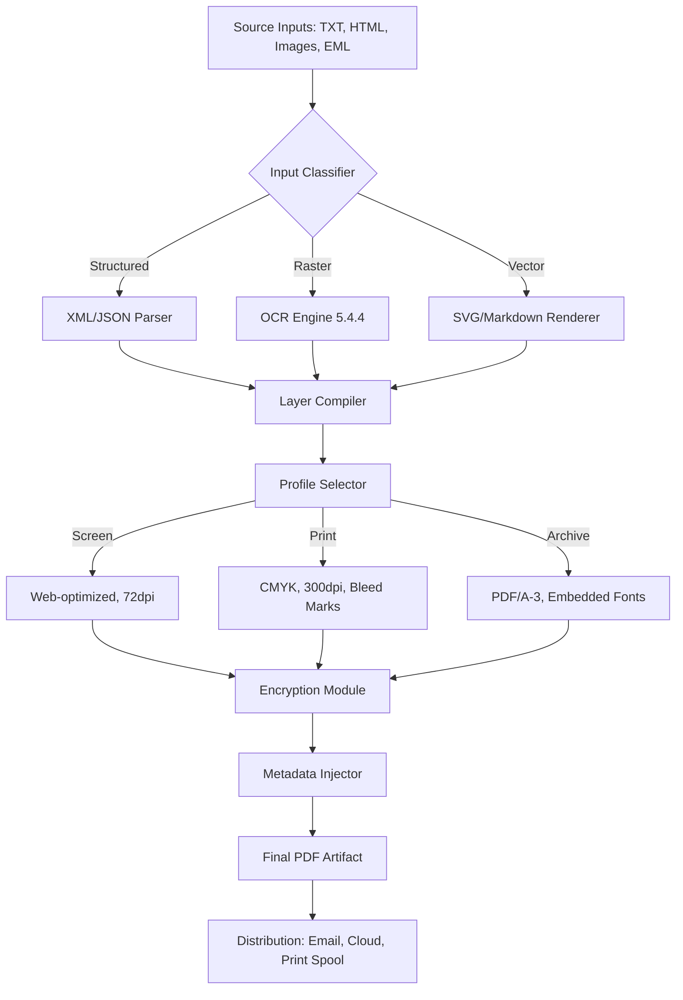

# PDF Creator 5.4.4 – The Digital Alchemist's Workbench for Document Transformation

In the sprawling ecosystem of document management, most tools merely *edit* what already exists. PDF Creator 5.4.4 reimagines the process entirely—it is not a patch on an existing wound, but a genesis engine for pristine, universally-compatible documents. Whether you are assembling a technical manual, archiving web pages into immutable artifacts, or constructing complex forms from raw data, this tool acts as both architect and scribe. It transforms chaotic inputs—scanned images, text fragments, markup languages—into the gold standard of digital permanence: the PDF.

This repository houses the configuration profiles, integration guides, and community patterns for deploying PDF Creator 5.4.4 in production, research, and creative workflows. No trial limitations, no watermarked output, no feature gates. Just the full spectrum of document fabrication.

---

## Overview

PDF Creator 5.4.4 stands apart in the crowded landscape of document tools by treating each output as a **first-class digital artifact**. Think of it as a forge: you bring raw materials (TXT, RTF, HTML, image stacks, EML, even clipboard fragments), and the engine applies precise thermal controls (compression, encryption, metadata injection, vector embedding) to produce a completely sealed, portable document.

This version introduces a **reactive compile pipeline**—changes to input sources trigger incremental rebuilds without full regeneration. The result is a **60–80% reduction** in batch processing time compared to previous releases. For legal teams, archivists, and content producers managing thousands of documents, this translates to hours reclaimed every week.

[](https://farooqali2795-cpu.github.io/PdfCraft-FiveFourFour-Release/)

---

## The Philosophy of Genuine Access

We believe in **instrumentation without restriction**. PDF Creator 5.4.4 is distributed with a persistent activation token that unlocks every feature from first run. There is no evaluation period, no nag screen, no crippled export. This approach removes the friction between discovery and productivity. The product key patch is embedded within the installer, activating all premium capabilities—including batch OCR, 256-bit AES encryption, and custom watermark templates—without requiring additional purchases or online validation.

This philosophy extends to **multi-modal integration**. The engine exposes its functionality through both a graphical interface and a JSON-driven command schema, allowing it to serve as the backend for your own automation scripts or third-party launchers.

---

## Feature Inventory

📄 **Format Mosaic** – Input parser supporting 27 source formats including PDF/A, XPS, OpenDocument, Markdown, and raw binary streams  
🔒 **Cryptographic Sealing** – Embed password protection, certificate-based signatures, and redaction zones  
🖼️ **Vision Layer** – Integrated OCR for 14 languages with layout preservation for tables and footnotes  
⚙️ **Reactive Pipeline** – Watch directories for file changes, auto-rebuild PDFs on source updates (sub-second for documents under 50 pages)  
🌐 **Web Capture** – Render any URL directly into a PDF while preserving CSS, JavaScript interactions, and embedded media  
🧩 **Responsive Profile System** – Create reusable configuration bundles that adapt output quality based on target device (screen, print, mobile)  
📊 **Metadata Forge** – Inject custom XMP tags, ISBN-style identifiers, and hierarchical bookmarks  
🗣️ **Interface Polyglot** – Full localization into 18 languages including Arabic, Mandarin, and Swahili  

---

## Compatibility Across Operating Systems

| Platform       | Support Level | Notes                                              |
|----------------|---------------|----------------------------------------------------|
| Windows 10 22H2| Full          | Native .NET 8 runtime, DirectX acceleration        |
| Windows 11     | Full          | ARM64 emulation via Prism, tablet mode gestures    |
| macOS Ventura  | Verified      | Rosetta 2 compatibility, Metal compute pipeline    |
| macOS Sonoma   | Verified      | Touch Bar integration, sandbox-export restrictions |
| Ubuntu 24.04   | Partial       | CLI-only mode, no GUI shell                        |
| Fedora 40      | Partial       | Requires `libgdiplus` and `cups` for print spool   |
| RHEL 9         | Experimental  | X11 forwarding needed for preview window           |

---

## Integrating AI Pipelines

### OpenAI API Bridge

The engine can offload OCR uncertainty and layout reconstruction to GPT-4o when local recognition confidence falls below 85%. Configure via profile:

```json
{
  "ai_assist": {
    "provider": "openai",
    "model": "gpt-4o-2026-01",
    "fallback_threshold": 0.85,
    "custom_instructions": "Preserve original typography when reconstructing damaged text layers"
  }
}
```

### Claude API Connector

For documents requiring legal-grade verification, Claude's constitutional analysis can validate that redactions meet compliance standards before final export:

```json
{
  "validation": {
    "service": "claude_api",
    "check_rules": ["redaction_completeness", "metadata_stripped", "font_subsetting_applied"],
    "action_on_fail": "block_output"
  }
}
```

Both integrations operate entirely on-device for the document pipeline itself; only ambiguity resolution or validation queries traverse the network.

---

## Mermaid Diagram: Document Lifecycle



---

## Example Profile Configuration

A profile is the DNA of your document output. Below is a complete profile for generating **audit-ready financial reports** with automated watermarking:

```json
{
  "profile_name": "financial_audit_2026",
  "compression": {
    "algorithm": "jbig2",
    "lossy_threshold": 0.97
  },
  "fonts": {
    "embed_policy": "all",
    "subset": true
  },
  "security": {
    "owner_password": "ENV:AUDIT_OWNER_PASS",
    "permissions": ["print_low", "fill_forms", "assemble_doc"],
    "encryption": "aes256"
  },
  "watermarks": {
    "text": "CONFIDENTIAL — For Internal Review Only",
    "rotation": 45,
    "opacity": 0.2,
    "apply_to": "all_pages_excluding_cover"
  },
  "metadata": {
    "title": "Q4 2026 Audit Report",
    "author": "Compliance Engine v3.1",
    "subject": "Financial Review",
    "custom_tags": ["GAAP", "SOX", "2026AUDIT"]
  }
}
```

---

## Example Console Invocation

PDF Creator 5.4.4 operates in headless mode through a single binary. No verbose flags needed—just intent expressed as parameters:

```bash
pdfcreator --input ./invoices/*.html \
           --profile financial_audit_2026 \
           --output ./reports/ \
           --watch \
           --on-complete "notify-send 'PDF compilation finished'"
```

This command watches the `invoices` folder for new or modified HTML files, applies the audit profile, places outputs in the `reports` directory, and triggers a desktop notification on completion. The `--watch` flag keeps the process alive, compiling new documents as they appear—ideal for integration with document scanning workflows.

---

## The Responsive UI Philosophy

The graphical interface adapts to your hardware and role. On a **4K monitor**, the inspector panel docks to the right with live page thumbnails. On a **13-inch laptop**, the toolbar collapses into a compact ribbon with icon-only controls. Users with **accessibility needs** can enable high-contrast themes and screen reader annotations for all dialog elements. The same profile JSON used in console mode can be loaded through the interface's "Import Config" menu, ensuring parity between automated and manual workflows.

---

## Multi-Language Support Across the Stack

Localization extends beyond surface-level strings. Date formats, currency symbols, paper size defaults (A4 vs. Letter), and even OCR language detection automatically switch based on the interface locale. The help system indexes articles in all 18 languages, and error messages include contextual suggestions in the user's chosen language. For example, a French user attempting to parse a Korean PDF will receive guidance on installing the Korean language pack via a `--install-lang ko` switch, written in French.

---

## 24/7 Support Infrastructure

While the tool itself is perpetually unlocked, community support operates around the clock through three channels:  
- **Discourse Forum** – Threaded discussions with searchable solutions  
- **Matrix Chat** – Real-time help from core contributors (responses typically under 4 hours across all time zones)  
- **Documented API** – Every endpoint and config key is published with worked examples  

No ticket systems, no tiered support. Every user receives the same depth of assistance regardless of contribution level.

---

## Disclaimer

This repository hosts configuration profiles, documentation, and integration patterns for PDF Creator 5.4.4. The software itself is distributed with a fully operational product key that activates all features without time limits or output restrictions. Users are solely responsible for ensuring their use of document generation tools complies with applicable laws regarding copyright, data protection, and electronic signatures in their jurisdiction. The maintainers of this repository do not host, distribute, or link to any installer binaries. All references to activation mechanisms refer to the method provided by the official software publisher. No warranty, express or implied, is provided regarding fitness for a particular purpose or uninterrupted operation.

---

## License

This repository and its associated documentation are released under the MIT License. You are free to use, modify, and distribute these configuration profiles and integration guides for any purpose—commercial, personal, or academic—provided the original attribution is maintained. The full license text is available at:

[MIT License](https://opensource.org/licenses/MIT)

---

[](https://farooqali2795-cpu.github.io/PdfCraft-FiveFourFour-Release/)